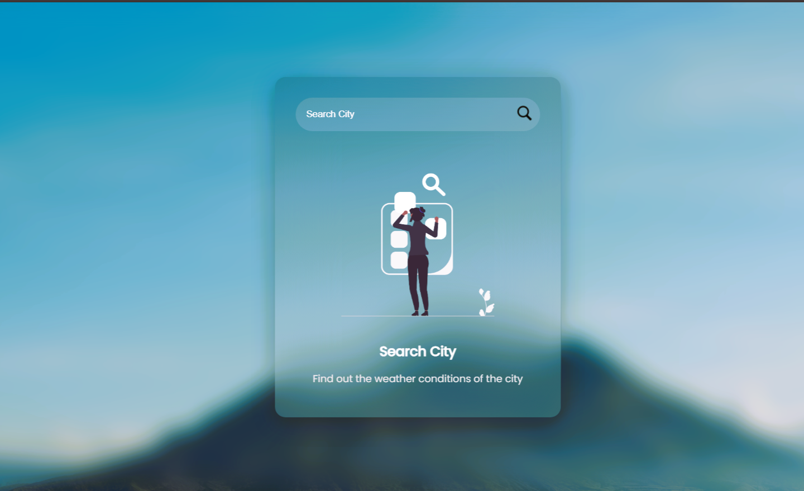
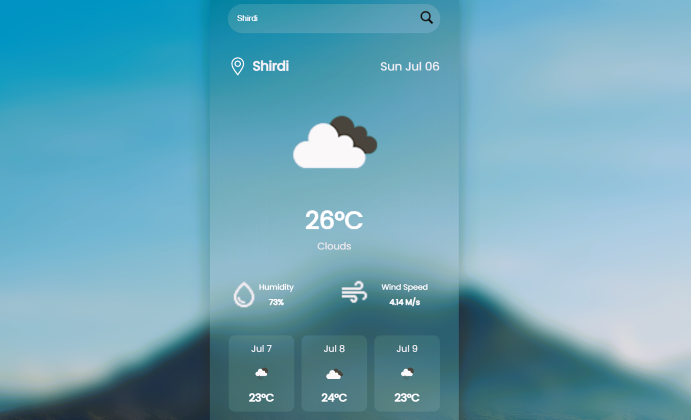
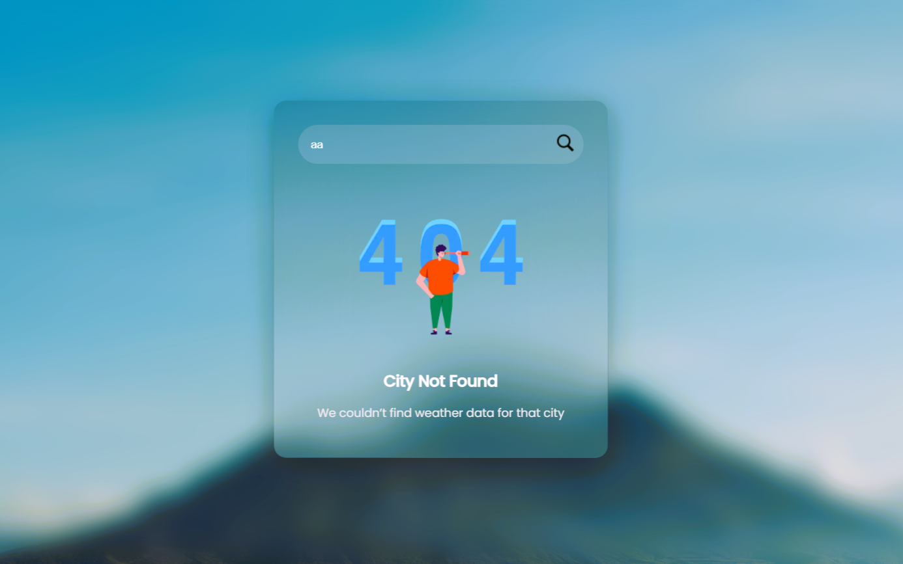

# ⛅ Weather App 🌍

A sleek and modern 🌐 web application for checking **live weather conditions** and 📅 forecasts in any city worldwide!  
Powered by public APIs, it offers **real-time weather updates**, beautiful visualizations, and an intuitive interface designed for everyone 🌟.

---

## 🌟 Features

- 🌦️ **Live Weather Updates** – See temperature, humidity, wind speed & more instantly.
- 🧭 **Smart Location Search** – Enter a city or let the app find your current location.
- 📅 **Forecast View** – Access 3-day / 5-day weather trends.
- 📱 **Responsive Design** – Works flawlessly on phones, tablets, and desktops.
- 🌗 **Light & Dark Mode** – Choose your vibe, day or night.
- 🧊 **Error Proof** – Clean, friendly alerts for bad requests or invalid cities.
- ⚡ **Optimized Performance** – Blazing-fast API responses and rendering!

---

## 🔍 Demo

<p align="center">
  
  
  
</p>


🚀 **Try it live:** [Click here](https://omtambe99.github.io/Weather-app/) 

---

## 🚀 Getting Started

### 📦 Prerequisites

- [📥 Node.js](https://nodejs.org/) (v16+)
- [📦 npm](https://www.npmjs.com/) or [yarn](https://yarnpkg.com/)

---

### 🔧 Installation

1. **Clone the repository:**
   ```bash
   git clone https://github.com/Omtambe99/Weather-app.git
   cd Weather-app
   ```

2. **Install dependencies:**
   ```bash
   npm install
   # or
   yarn install
   ```

3. **Set up your API key:**
   - Get your free API key from [🌐 OpenWeatherMap](https://openweathermap.org/api)
   - Create a `.env` file in the project root:
     ```
     REACT_APP_WEATHER_API_KEY=your_api_key_here
     ```

4. **Start the app locally:**
   ```bash
   npm start
   # or
   yarn start
   ```

🌐 Visit: [http://localhost:3000](http://localhost:3000)

---

## 🧑‍💻 Usage

1. 🔍 Type a city in the search bar or tap **Use My Location**.
2. ⛅ See detailed weather info and forecasts.
3. 🌞🌙 Toggle light/dark mode to match your style.

---

## 🗂️ Project Structure

```
Weather-app/
├── public/
│   └── index.html
├── src/
│   ├── components/     # Reusable UI components (WeatherCard, SearchBar, etc.)
│   ├── assets/         # Images & icons
│   ├── api/            # API logic
│   ├── utils/          # Utility functions
│   ├── App.js
│   └── index.js
├── .env
├── package.json
└── README.md
```

---

## ⚙️ Configuration

- 🔐 **API Key:** Saved as `REACT_APP_WEATHER_API_KEY` in your `.env` file.
- 🌡️ **Temperature Units:** Toggle between Celsius and Fahrenheit in the UI (if enabled).

---

## 🛠️ Tech Stack

- **Frontend:** ⚛️ React.js, 🎨 CSS3, 🧱 HTML5  
- **Weather API:** 🌐 [OpenWeatherMap](https://openweathermap.org/)
- **State Management:** 🔄 React Hooks / Context API  
- **Styling:** Tailwind CSS / Styled Components / CSS Modules *(customize as per your project)*  
- **Deployment:** 🚀 Vercel / Netlify / GitHub Pages *(mention yours)*

---

## 🤝 Contributing

We 💙 contributions!  
Here’s how to help:

1. Fork this repo 🍴  
2. Create a new branch: `git checkout -b feature/AmazingFeature`  
3. Make your changes 🚧  
4. Commit: `git commit -m "Add amazing feature"`  
5. Push: `git push origin feature/AmazingFeature`  
6. Open a pull request 📬

---

## 📄 License

📝 [MIT License](LICENSE)

---

## 🙌 Acknowledgements

- 🌍 [OpenWeatherMap](https://openweathermap.org/)
- ⚛️ [React](https://reactjs.org/)
- 📷 [Unsplash](https://unsplash.com/) – For weather-themed images *(if used)*

---

## 📬 Contact

Made with ❤️ by [@Omtambe99](https://github.com/Omtambe99)  
Have questions or ideas? Let’s connect!
